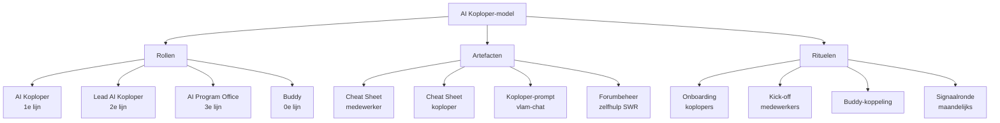
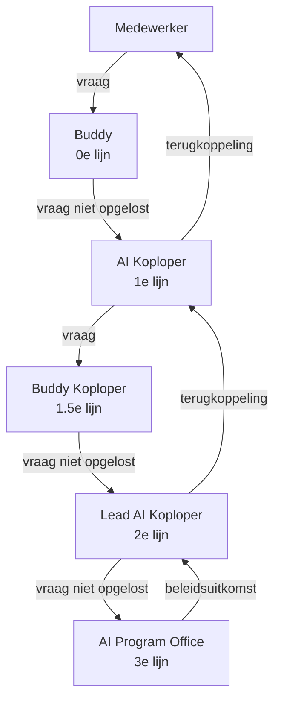

# AI Koplopers in 20 Dagen
## Draaiboek voor een werkende adoptiestructuur

**Versie:** 1.0  
**Taal:** Nederlands  
**Licentie:** CC BY 4.0: vrij te gebruiken, aanpassen en verder verspreiden mits met bronvermelding  
**Doelgroep:** Programmamanagers, CIO-office, verandermanagers, AI-leads in overheids- en semipublieke organisaties  
**Gebruik:** Dit document is ontworpen om in een LLM te worden ingeladen. Stel vragen zoals: "Wat doet een AI Koploper in week 1?" of "Wat zijn de anti-keuzes?" Het bevat alle informatie die je daarvoor nodig hebt.
**Oorsprong:** Ontworpen en geïmplementeerd (in 20 dagen) door Michiel Buisman bij het Rijksvastgoedbedrijf (RVB), onderdeel van het Ministerie van Binnenlandse Zaken en Koninkrijksrelaties, Nederland.  

---

## Managementsamenvatting

### Waarom dit document bestaat

Sommmige organisaties die AI uitrollen, maken een voorspelbare fout: ze beschouwen technische beschikbaarheid als adoptie. Een licentie uitdelen is niet hetzelfde als een werkmethode inbedden. De eerste honderd gebruikers zijn enthousiastelingen die zichzelf redden. De volgende duizend zijn de vroege meerderheid. Die verwachten dat de toepassing af is, adequaat ondersteund wordt en past bij hoe zij werken.

Dit draaiboek beschrijft hoe je in twintig dagen een structuur neerzet die die overgang begeleid. Niet met ambassadeurs die motivatie uitdragen, maar met koplopers die naast collega's staan en samen ontdekken.

### Wat het oplevert

Een goed uitgevoerd AI Koploper-programma levert drie dingen op:

**Adoptie die beklijft.** Niet door communicatiedruk, maar doordat medewerkers zelf ervaren dat AI hen helpt bij werk dat ze saai of tijdrovend vinden. De koploper helpt die eerste bruikbare ervarining te vinden.

**Een kanaal voor signalen.** Koplopers zien wat wel en niet werkt, welke vragen er leven, en waar de grens van de tooling zit. Dat signaal is onmisbaar voor governance en doorontwikkeling.

**Een epistemische reflex.** Medewerkers die leren AI-output te beoordelen, leren tegelijkertijd kritisch omgaan met plausibel ogende informatie in het algemeen. Dit is een neveneffect met organisatiebrede waarde en een governance-risico als niemand er eigenaarschap over heeft.

### Wat het kost om het níét te doen

Zonder een begeleidingsstructuur zijn de meest voorspelbare uitkomsten:

- Teleurstelling bij de vroege meerderheid leidt tot een negatieve attitude tegenover de volledige AI-aanpak.
- Ongecontracteerde AI (ChatGPT e.d.) blijft in gebruik omdat het de enige tool is die medewerkers al kennen en vertrouwen.
- Gebruik van ongecontracteerde AI in een werkcontext creëert een juridisch risico dat in de ergste gevallen betekent dat besluiten van een sectie, afdeling of directie teruggedraaid moeten worden tot het moment van het eerste ongeoorloofde gebruik.
- Koplopers die meer investeren dan ze terugkrijgen haken af; juist de meest geactiveerde mensen.

### Wat dit níét is

Dit draaiboek beschrijft geen ambassadeursprogramma. Ambassadeurs zijn gemotiveerde enthousiastelingen die AI uitdragen. Koplopers zijn vakgenoten die naast hun collega's staan, dezelfde vragen hebben en samen uitzoeken wat werkt. Het verschil zit in de sociale positie: een ambassadeur overtuigt, een koploper ontdekt.

Dit is ook geen top-down implementatieprogramma. De koploper bepaalt niet welke taken geautomatiseerd worden. Dat bepaalt de medewerker zelf, vanuit intrinsieke motivatie. De koploper stelt de juiste vragen en helpt het proces structuur geven.

---

## Het model in één oogopslag

Het AI Koploper-model heeft drie pijlers, analoog aan Scrum: **rollen**, **artefacten** en **rituelen**. Zo blijft het overdraagbaar en aanpasbaar zonder dat de kern verloren gaat.

---

## Rollen

### AI Koploper (1e lijn)

De AI Koploper is het eerste aanspreekpunt voor collega's met vragen over de AI-tooling. Geen expert, geen trainer — een werkende collega met iets meer ervaring en geborgde tijd om te helpen.

**Kenmerken:**
- Beschikt als eerste over de AI-tooling en heeft er minimaal twee weken mee gewerkt voor de kick-off
- Heeft 2 uur per week geborgde tijd, toegekend door de lijnmanager
- Is gelijkmatig verdeeld over de organisatie (één koploper per team of afdeling)
- Fungeert als verbindingspunt tussen medewerkers en de Lead AI Koploper

**Wat een koploper doet:**
- Organiseert en houdt de kick-off voor het eigen team
- Beantwoordt eerste vragen ("dat zoeken we samen uit" is een volwaardig antwoord)
- Signaleert wat werkt, wat niet werkt en wat regelmatig terugkomt als vraag
- Deelt bevindingen in het zelfhulpforum
- Koppelt medewerkers aan een buddy

**Wat een koploper niet doet:**
- Garanties geven over wat AI wel of niet mag
- Technische implementaties bouwen of beheren
- Formeel beleid vaststellen
- Iedereen van zijn of haar gelijk overtuigen

**Anti-keuze:** Een koploper is geen excellentie-rol en geen showcase voor AI-enthousiasme. Wie als koploper wordt ingezet als interne promotor in plaats van als vakgenoot, verliest de sociale positie die de rol effectief maakt.

---

### Lead AI Koploper (2e lijn)

De Lead AI Koploper coördineert de koploperscommunity, vangt escalaties op die de eerste lijn overstijgen en is de verbindingsfunctie naar het AI Program Office en naar rijksbrede netwerken (zoals de BZK AI Ambassadeurs).

**Kenmerken:**
- Fulltime rol (of substantieel gedeelte van een functie)
- Beantwoordt vragen in het zelfhulpforum die de koploper niet kan beantwoorden, of zet ze door naar de derde lijn
- Signaleert patronen in vragen en escalaties en vertaalt die naar verbetervoorstellen
- Beheert de koploperlijst en coördineert licentieverstrekking

**Anti-keuze:** De Lead AI Koploper is geen content-fabriek. Als de rol primair bestaat uit het produceren van materialen, gaat de signaal- en verbindingsfunctie verloren.

---

### AI Program Office / AIPO (3e lijn)

Het AI Program Office draagt de beleidskaders, governance en de structurele doorontwikkeling van de aanpak. Beantwoordt complexe juridische, technische of strategische vragen die de tweede lijn overstijgen.

**Anti-keuze:** Het AIPO is geen operationele helpdesk. Directe vragen van medewerkers die de eerste en tweede lijn overslaan, verlagen de adoptie van het lijnensysteem en overbelasten de derde lijn.

---

### Buddy (0e lijn)

De buddy is een collega (medewerker of koploper) aan wie je als eerste een vraag stelt. De buddy is geen formele rol maar een structurele koppeling. Twee weten meer dan één. De buddy verlaagt de drempel om überhaupt een vraag te stellen.

**Toewijzing:** Koplopers koppelen elke medewerker aan een buddy tijdens de kick-off. Koplopers hebben zelf ook een buddy (een andere koploper).

**Anti-keuze:** Buddykoppelingen die op papier bestaan maar in de praktijk niet worden gebruikt, zijn geen buddy-systeem. De koppeling werkt alleen als er een eerste gezamenlijke activiteit plaatsvindt direct na de kick-off.

---

### Escalatiestructuur

---

## Artefacten

### Cheat Sheet medewerker

Twee A4-pagina's. Bevat de minimale informatie die een medewerker nodig heeft om te beginnen en om te weten wanneer hij of zij iets niet moet doen. De omvang is een harde beperking: iets toevoegen betekent iets verwijderen.

**Bevat:**
- Waarvoor vlam-chat wel en niet geschikt is (concrete voorbeelden)
- De drie kernvragen: kan het, mag het, willen we het
- Wat je nooit doet (persoonsgegevens uploaden, juridische besluiten delegeren aan AI, output niet controleren)
- Escalatiepad: koploper → Lead → AIPO
- Contactgegevens koploper

**Anti-keuze:** Een cheat sheet die uitgroeit tot een handleiding werkt niet meer als cheat sheet. De lengtegrens is functioneel, niet esthetisch.

---

### Cheat Sheet koploper

Twee A4-pagina's. Gericht op de rol van de koploper, niet op het gebruik van de tool. Bevat de koploper-prompt voor vlam-chat (zie hieronder).

**Bevat:**
- Samenvatting van de rol (heart/mind/hands: ambassadeur, key user, super user)
- De koploper-prompt voor vlam-chat
- Wanneer je doorverwijst (naar de Lead of het AIPO)
- Wat "samen uitzoeken" in de praktijk betekent
- Hoe je de kick-off aanpakt

---

### Koploper-prompt voor vlam-chat

Een herbruikbare systeemprompt waarmee de koploper vlam-chat inzet als eigen assistent voor koplopervragen. De prompt instrueert vlam-chat om te antwoorden vanuit de drie roldimensies (heart/mind/hands), in het Nederlands, actiegericht, en met expliciete doorverwijzing naar de Lead als de vraag het eerste-lijns mandaat overstijgt.

De koploper laadt de actuele cheat sheets als bijlage mee bij elke sessie.

---

### Forumbeheer in de samenwerkruimte (SWR)

Het zelfhulpforum is de gedeelde kennisbank van het koplopernetwerk. Vragen en antwoorden die in het forum worden geplaatst zijn zichtbaar voor alle koplopers en medewerkers.

**Spelregels:**
- Koplopers plaatsen vragen en antwoorden ook als ze het antwoord al via een ander kanaal hebben gevonden
- De Lead beantwoordt vragen die onbeantwoord blijven, of escaleert naar het AIPO
- Het forum is de primaire plek voor "wat werkt en wat niet" — geen privéberichten voor onderwerpen die voor de community nuttig zijn

---

### Koploperoverzicht

Een eenvoudig overzicht (spreadsheet of lijst) met per koploper: naam, team, buddykoppeling, datum kick-off uitgevoerd, aantal medewerkers bereikt. Beheerd door de Lead AI Koploper.

---

## Rituelen

### Onboarding koplopers

**Doel:** Koplopers voorbereiden op hun rol voor ze de kick-off voor medewerkers houden.  
**Duur:** 2–3 uur (inclusief oefening)  
**Deelnemers:** Alle koplopers van het cohort, Lead AI Koploper, AIPO-vertegenwoordiger  
**Frequentie:** Eenmalig per cohort, daarna periodiek voor nieuwe koplopers

**Programma:**
1. Kader: waarom koplopers, wat is het verschil met ambassadeurs, wat is het programma
2. De drie kernvragen (kan/mag/wil) in eigen woorden
3. Oefening: wat doe je als een medewerker vraagt of hij vertrouwelijke documenten mag uploaden?
4. Buddy-koppeling: elke koploper weet wie zijn of haar buddy is en heeft die tijdens de onboarding gesproken
5. Kick-off voorbereiden: koplopers plannen hun eigen kick-off in, met een concreet datum

**Uitkomst:** Elke koploper verlaat de onboarding met een geplande kick-off, een gekoppelde buddy en de cheat sheets.

---

### Kick-off medewerkers

**Doel:** Medewerkers een eerste werkende ervaring met vlam-chat geven en de koploper in zijn of haar rol zetten.  
**Duur:** 1 uur (maximaal 1,5 uur)  
**Deelnemers:** Team van de koploper, eventueel buddy-koploper als co-facilitator  
**Frequentie:** Eenmalig per team; vereist voor licentieverstrekking

**Programma:**
1. Waarom vlam-chat (kort: context, doelstelling, wat het niet is)
2. Eerste ervaring: iedereen probeert één prompt op een eigen, saai, herhalend werkstuk
3. De drie kernvragen bespreken aan de hand van een concreet voorbeeld uit het team
4. Buddy-koppeling: iedereen weet wie zijn of haar buddy is
5. Afspraak: wanneer spreken we elkaar voor het eerst over wat we zijn tegengekomen?

**Indicatoren voor een goede kick-off:**
- Elke deelnemer heeft zelf iets getypt in vlam-chat
- Elke deelnemer heeft een buddy
- Er zijn minimaal twee vragen gesteld die de koploper niet direct kon beantwoorden (dit is een goed teken, geen fout)
- De sfeer is onderzoekend, niet overtuigend

**Anti-keuze:** Een kick-off die primair bestaat uit uitleg en presentatie zonder dat medewerkers zelf iets doen, haalt het effect niet. Actieve participatie is het centrale mechanisme.

---

### Signaalronde (maandelijks)

**Doel:** Patronen verzamelen uit de praktijk van koplopers en vertalen naar verbeteringen in materialen, escalatiepaden of governance.  
**Duur:** 45–60 minuten  
**Deelnemers:** Lead AI Koploper, alle actieve koplopers  
**Frequentie:** Maandelijks

**Vaste vragen:**
- Welke vraag heb je drie of meer keer gehad die je niet goed kon beantwoorden?
- Wat werkt opvallend goed in jouw team?
- Waar loopt de tool tekort ten opzichte van wat medewerkers proberen te doen?
- Is er iemand die dreigt af te haken — als koploper of als medewerker?

**Uitkomst:** De Lead noteert patronen en vertaalt ze naar een signaallog voor het AIPO. Verbeteringen aan cheat sheets of materialen worden teruggekoppeld naar het koplopernetwerk.

---

## De 20-dagenplanning

Twintig werkdagen (vier weken) zijn voldoende om een werkende eerste lijn operationeel te hebben. De planning gaat uit van een cohort van maximaal 20 koplopers in de eerste ronde.

```mermaid
gantt
    title AI Koplopers in 20 Dagen
    dateFormat  D
    axisFormat  Dag %d

    section Voorbereiding
    Selectie koplopers (lijnmanager akkoord)    :a1, 1, 3d
    Materialen gereed (cheat sheets, prompt)    :a2, 1, 3d
    Licenties klaarzetten (SSC-ICT)             :a3, 2, 2d

    section Onboarding koplopers
    Onboarding sessie cohort 1                  :b1, 4, 1d
    Buddy-koppeling koplopers                   :b2, 4, 1d
    Koplopers plannen kick-offs in              :b3, 5, 2d

    section Kick-offs medewerkers
    Kick-offs uitvoeren (cohort 1)              :c1, 7, 8d
    Licenties activeren voor kick-off    :c2, 7, 8d

    section Eerste signaalronde
    Signaalronde koplopers cohort 1             :d1, 17, 1d
    Verbeteringen verwerken in materialen       :d2, 18, 2d
    Evaluatie en start voorbereiding cohort 2   :d3, 20, 1d
```

### Dag-voor-dag overzicht

**Dag 1–3: Voorbereiding**

- AIPO of programmamanager: identificeer kandidaat-koplopers per team of afdeling. Criteria: beschikbaar voor 2 uur per week, lijnmanager akkoord, bereid om als eerste te beginnen (niet: enthousiasme als selectiecriterium).
- Cheat sheets en koploper-prompt zijn gereed of worden definitief gemaakt in deze periode.
- SSC-ICT of beheerder ontvangt de koploperslijst voor licentie-activering.

**Dag 4–6: Onboarding koplopers**

- Onboarding sessie (2–3 uur) voor alle koplopers van het cohort.
- Elke koploper heeft na afloop een geplande kick-off, een buddy en de actuele cheat sheets.
- Koplopers die na de onboarding nog twijfelen over hun kick-off worden individueel begeleid door de Lead.

**Dag 7–16: Kick-offs medewerkers**

- Koplopers houden kick-offs in hun eigen team. Timing is flexibel maar vereist om licenties te activeren.
- Lead houdt bij welke kick-offs zijn uitgevoerd en activeert licenties na bevestiging.
- AIPO-vertegenwoordiger is beschikbaar als achtervang voor koplopers met vragen die de cheat sheet overstijgen.

**Dag 17: Eerste signaalronde**

- Alle koplopers brengen hun eerste ervaringen in. Wat werkt, wat niet, welke vragen komen terug.
- Lead noteert patronen. Verbeteringen worden doorgevoerd voor cohort 2.

**Dag 18–20: Verwerking en voorbereiding cohort 2**

- Cheat sheets bijgewerkt op basis van signalen uit cohort 1.
- Selectie en uitnodiging koplopers cohort 2 wordt gestart.
- Evaluatierapportage aan opdrachtgever: hoeveel kick-offs uitgevoerd, hoeveel licenties geactiveerd, eerste signalen uit de praktijk.

---

## Randvoorwaarden

### Minimaal vereist

- Lijnmanager akkoord voor 2 uur per week per koploper. Zonder dit is de rol niet functioneel.
- Werkende tooling beschikbaar voor koplopers minimaal twee weken voor de kick-off van hun team.
- Lead AI Koploper operationeel voor de start van het programma.
- Cheat sheets vastgesteld en klaar voor gebruik (niet "bijna klaar").
- Buddy-systeem zowel voor koplopers onderling als voor medewerkers actief.

### Gewenst maar niet blokkerend

- Zelfhulpforum in de samenwerkruimte actief en gemodereerd.
- AIPO beschikbaar voor derdelijns vragen.

### Bekende risico's

| Risico | Gevolg | Maatregel |
|---|---|---|
| Lijnmanager geeft geen geborgde tijd | Koploper valt uit | Commitment vragen voor start; lijnmanager is eigenaar, niet AIPO |
| Tooling werkt niet tijdens kick-off | Desillusie bij medewerkers | Koploper oefent vooraf; alternatief klaar (privé-testomgeving of schermopname) |
| Te weinig koplopers voor de organisatieomvang | Overbelasting eerste koplopers | Faseer cohorten; start met vrijwilligers, breid dan uit |
| Cheat sheets groeien uit tot handleidingen | Koplopers lezen ze niet meer | Harde omvangsregel handhaven; Lead beheert dit actief |
| Koploper wordt gezien als AI-afdeling | Verkeerde verwachtingen | Framing in kick-off: koploper = collega, niet expert |

---

## Cultuureffect: wat je er gratis bij krijgt

Het AI Koploper-programma installeert een neveneffect dat niet in de doelstellingen staat maar er wel uit voortvloeit: medewerkers die leren AI-output te beoordelen met gekalibreerde twijfel, leren tegelijkertijd plausibel ogende informatie in het algemeen kritischer te lezen. Dit effect generaliseert buiten de AI-context.

In een organisatie met een cultuur van beleefde acceptatie (waar urgente problemen worden herkend maar niet uitgesproken) is dit een waardevolle beweging. Het schept laterale vertrouwenskanalen buiten de formele hiërarchie en produceert medewerkers die privékennis vaker omzetten in publieke actie.

Dit effect is ook een governance-risico: als niemand formeel verantwoordelijk is voor wat er met die verschuiving gebeurt, produceert het wrijving in plaats van bruikbaar signaal. De aanbeveling is om dit effect te benoemen, een eigenaar te geven en te verbinden aan structurele outlets: pre-mortems, anonieme inputmechanismen, ruimte voor dissent in vergaderstructuren.

---

## Anti-keuzes

Dit zijn keuzes die je bewust niet maakt in het AI Koploper-model, en waarom.

**Geen ambassadeurs als vervanging voor koplopers.** Ambassadeurs werken vanuit motivatie en uitstraling. In een organisatie die al gemotiveerd is, voegen ze weinig toe. Koplopers werken vanuit vakgenootschap en nabijheid. Dat is wat de vroege meerderheid nodig heeft.

**Geen verplichte deelname zonder toolinggereedheid.** Een kick-off organiseren terwijl de tool nog niet werkt of niet beschikbaar is, produceert precies de desillusie die je wilt voorkomen.

**Geen uitbreiding van de cheat sheet zonder verwijdering.** Elke toevoeging die niet gepaard gaat met een verwijdering, maakt het document minder bruikbaar. De lengte is functioneel.

**Geen koplopers selecteren op enthousiasme.** Enthousiaste mensen zijn aantrekkelijke koplopers maar lopen het risico niet representatief te zijn voor hun team. Selecteer op beschikbaarheid, sociaal vertrouwen in het team en de bereidheid om eerlijk te zijn over wat niet werkt.

**Geen directe lijn van medewerkers naar het AIPO.** Dit omzeilt het lijnensysteem, overbelast de derde lijn en haalt de ontwikkeling van de eerste lijn onderuit. De koploper moet de vraag kunnen afhandelen of doorsturen — dat is de waarde van de structuur.

**Geen top-down bepaling van welke taken geautomatiseerd worden.** Dit sloopt de intrinsieke motivatie van medewerkers en produceert precies het soort deskilling dat het juridische kader verbiedt. De medewerker bepaalt, de koploper faciliteert.

**Geen ongecontracteerde AI als tijdelijk alternatief.** Ongecontracteerde AI in een werkcontext creëert een juridisch risico dat retroactief werkt: besluiten die zijn beïnvloed door het gebruik ervan kunnen teruggedraaid worden. Er is geen grens te trekken die dit beheersbaar maakt.

---

## FAQ

**Hoe lang duurt het voordat een koploper effectief is?**  
Na de onboarding en de eerste kick-off is een koploper operationeel. Effectiviteit groeit in de eerste vier tot zes weken, als de koploper reguliere vragen begint te herkennen en routinematig kan afhandelen.

**Wat als een medewerker de koploper omzeilt en direct naar het AIPO belt?**  
De derde lijn verwijst terug naar de eerste. Niet als straf maar als service: de koploper is de meest nabije en best gepositioneerde lijn voor de vraag. Als dit structureel voorkomt, is er iets mis met de bekendheid of het vertrouwen in de eerste lijn — dat is een signaal voor de Lead.

**Wat als een koploper niet weet wat de koploper moet weten?**  
"Dat zoeken we samen uit" is een legitiem antwoord. "Ik weet het niet en ik vraag het door" is beter. Het verwachtingsmanagement in de kick-off regelt dit: de koploper is geen expert, maar een navigator.

**Kan een koploper ook de Lead AI Koploper zijn?**  
Nee. De Lead heeft een coördinerende en signalerende rol die incompatibel is met een individuele teamverantwoordelijkheid. De rollen zijn functioneel gescheiden.

**Wat als de tooling te beperkt is om de verwachtingen van medewerkers te managen?**  
De kick-off stelt verwachtingen bij door te beginnen met wat de tool nu kan, niet met wat hij ooit zal kunnen. De framing is: dit is een werkende eerste versie van iets dat doorontwikkelt — jouw feedback vormt de richting. Als de tool structureel tekortschiet voor de use cases die medewerkers relevant vinden, is dat een signaal voor de tweede en derde lijn.

**Wat als een medewerker toch ChatGPT blijft gebruiken?**  
Mild: het verbod benoemen zonder morele veroordeling. Duidelijk: de juridische consequentie uitleggen (niet als dreiging, maar als feit). Praktisch: samen kijken of de use case die de medewerker heeft ook werkt met de gecontracteerde tool, eventueel met een workaround.

**Moeten alle koplopers tegelijk onboarden?**  
Nee, maar een cohort van minimaal vijf koplopers tegelijk maakt de buddy-koppeling en het gemeenschapsgevoel werkbaar. Één-op-één-onboarding mist het peer-leren dat de sessie effectief maakt.

**Is dit model geschikt voor kleinere organisaties?**  
Ja, met aanpassingen. De Lead AI Koploper-rol kan gecombineerd worden met de AIPO-rol als de organisatie klein genoeg is. Het buddysysteem en de kick-off blijven werken ongeacht de schaal.

