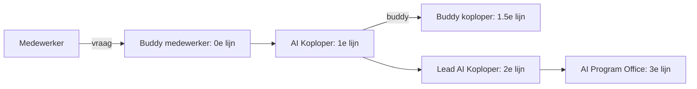
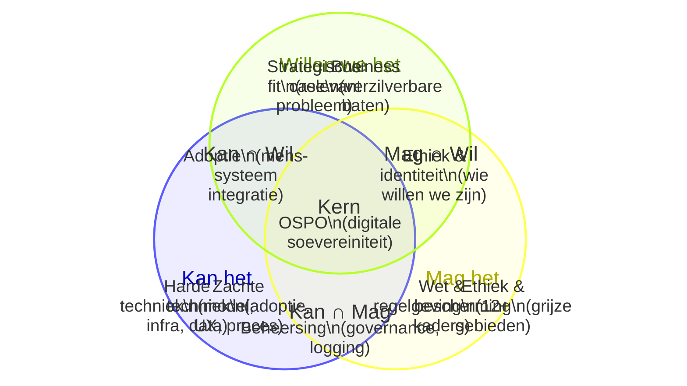
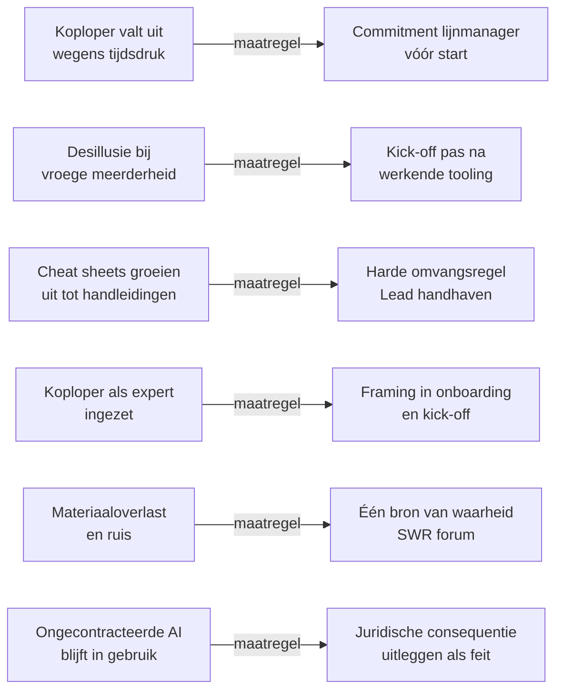

# Het AI Koploper-raamwerk
## Een open standaard voor AI-adoptie in organisaties

**Versie:** 1.0  
**Licentie:** CC BY 4.0: vrij te gebruiken, aanpassen en verder verspreiden mits bronvermelding  
**Oorsprong:** Ontworpen en geïmplementeerd (in 20 dagen) door Michiel Buisman bij het Rijksvastgoedbedrijf (RVB), onderdeel van het Ministerie van Binnenlandse Zaken en Koninkrijksrelaties, Nederland.  
**Gebruik:** Dit document is ontworpen als referentie voor implementators. Het is ook geschikt als context voor een LLM-chat: laad het document in en stel vragen als "wat zijn de kernprincipes?" of "hoe verschilt dit van een ambassadeursprogramma?"

---

## Inleiding

AI-adoptie kan falen door gebrek aan nabijheid: niemand die naast de medewerker staat op het moment dat die voor het eerst iets probeert. Enthousiasme vanuit een communicatieafdeling bereikt mensen niet op het moment dat het ertoe doet. Een collega in hetzelfde team, die dezelfde werkdruk kent en dezelfde vragen heeft, wel.

Het AI Koploper-raamwerk beschrijft een adoptiestructuur die werkt via vakgenootschap en nabijheid, niet via motivatiecampagnes. Het is gebaseerd op bekende principes uit technology adoption theory (Rogers), super-user implementaties uit IT-best practices, en peer-learning-structuren uit organisatiepsychologie.

Het raamwerk is specifiek ontworpen voor de overgang van de eerste adoptiefase (innovators en early adopters) naar de vroege meerderheid — de groep die adoptie of afwijzing bepaalt. Deze groep verwacht dat een tool af is, adequaat ondersteund wordt en aansluit op hoe zij werken. Dat vraagt om een andere benadering dan de eerste fase.

---

## Kernprincipes

Deze principes zijn niet optioneel. Ze zijn de reden dat het raamwerk werkt. Aanpassen van de implementatie is mogelijk; aanpassen van de principes produceert een ander model.

**1. Vakgenootschap boven excellence.** De koploper is een collega, geen expert. De sociale gelijkheid is de bron van effectiviteit. Een koploper die als showcase of excellentie-figuur wordt ingezet, verliest de positie die de rol bruikbaar maakt.

**2. Ontdekken boven overtuigen.** De koploper overtuigt niet. De koploper helpt de medewerker een eerste bruikbare ervaring te vinden. Intrinsieke motivatie volgt uit de ervaring, niet uit de uitleg.

**3. Samen uitzoeken als legitiem antwoord.** "Ik weet het niet, laten we het samen uitzoeken" is een volledig antwoord. Het model vraagt geen volledigheid: het vraagt nabijheid en navigatievermogen.

**4. Minimale materialen met harde grenzen.** Cheat sheets zijn twee A4-pagina's en blijven dat. Elke toevoeging vereist een verwijdering. Dit is een functionele keuze: Het grootste gevaar in het AI-tijdperk is informatie-overload.

**5. Symmetrie in begeleiding.** Hoe het AIPO de koplopers begeleidt, is identiek aan hoe koplopers medewerkers begeleiden: een korte start, een buddy, beperkte materialen, zelfhulp als primaire lijn. Dit maakt het model schaalbaar en overdraagbaar.

**6. Uitkomsten zonder micromanagement.** Het raamwerk stuurt op uitkomsten (medewerker heeft een werkende eerste ervaring, koploper signaleert patronen). Er zijn geen KPI's op activiteiten (koploper geeft zoveel trainingen per maand). Intrinsieke motivatie vraagt ruimte en uitkomstengerichtheid.

**7. Escalatie als kwaliteitssignaal.** Een vraag die de eerste lijn niet kan beantwoorden en doorkomt bij de tweede lijn is een goed teken: het systeem werkt. Escalatie is geen falen.

---

## Rollen

### Overzicht

### Rolbeschrijvingen

| Rol | Kernverantwoordelijkheid | Tijdsbesteding | Lijn |
|---|---|---|---|
| **Medewerker** | Gebruikt AI-tooling, stelt vragen aan buddy of koploper, geeft signalen door | Ad hoc | — |
| **Buddy** | Eerste informele vraagbeantwoording voor medewerker of koploper | Informeel | 0e |
| **AI Koploper** | Eerste lijn ondersteuning, organiseert kick-off, signaleert patronen | 2 uur/week geborgd | 1e |
| **Lead AI Koploper** | Coördinatie koploperscommunity, escalatie, signaalverwerking, verbinding met rijksbrede netwerken | Substantieel of fulltime | 2e |
| **AI Program Office (AIPO)** | Beleidskaders, governance, complexe vraagstukken, doorontwikkeling aanpak | Fulltime | 3e |

### Seleciecriteria AI Koploper

Een AI Koploper wordt geselecteerd op:
- Beschikbaarheid (2 uur per week met lijnmanager-akkoord)
- Sociaal vertrouwen in het team (collega's stellen vragen aan deze persoon)
- Bereidheid om eerlijk te zijn over wat niet werkt

Een AI Koploper wordt **niet** geselecteerd op:
- Enthousiasme voor AI
- Technische kennis
- Positie in de hiërarchie

---

## Artefacten

Artefacten zijn de tastbare producten van het raamwerk. Ze zijn in omvang begrensd en in inhoud functioneel: wat er niet inzit, was geen bewuste weglating maar een bewuste keuze.

### Cheat Sheet medewerker

**Omvang:** 2 A4  
**Doel:** Medewerker kan beginnen en weet wanneer hij of zij iets niet moet doen  
**Verplichte onderdelen:**
- Drie kernvragen: kan het, mag het, willen we het
- Concrete voorbeelden van geschikte en ongeschikte use cases
- Wat nooit: persoonsgegevens uploaden, AI-output zonder controle doorsturen, juridisch relevante besluiten delegeren
- Escalatiepad: buddy → koploper → Lead → AIPO
- Contactgegevens koploper

### Cheat Sheet koploper

**Omvang:** 2 A4  
**Doel:** Koploper weet hoe de rol werkt en heeft de koploper-prompt bij de hand  
**Verplichte onderdelen:**
- Roldefinitie in drie dimensies (heart/mind/hands)
- De koploper-prompt voor de AI-tooling
- Wanneer doorverwijzen
- Hoe de kick-off te houden
- Contactgegevens Lead AI Koploper en AIPO

### Koploper-prompt

Een herbruikbare systeemprompt voor de AI-tooling, waarmee de koploper de tool inzet als assistent voor koplopervragen. De prompt instrueert de tool om:
- Te antwoorden vanuit de drie roldimensies
- Vragen die het mandaat overstijgen door te verwijzen
- Actiegericht te antwoorden (geen theorie)
- In het Nederlands te antwoorden, ook op Engelstalige prompts

De koploper geeft de actuele cheat sheets als bijlage mee.

### Koploperoverzicht

**Eigenaar:** Lead AI Koploper  
**Inhoud:** Per koploper: naam, team, buddy, datum kick-off uitgevoerd, aantal bereikten medewerkers  
**Gebruik:** Basis voor licentiebeheer, signaalronden en cohortplanning

### Zelfhulpforum

**Platform:** Samenwerkruimte (SharePoint, Teams, of equivalent)  
**Eigenaar:** Lead AI Koploper  
**Spelregel:** Vragen en antwoorden die ook voor anderen nuttig zijn, horen in het forum: niet in privéberichten

---

## Rituelen

Rituelen zijn de terugkerende activiteiten die de structuur in stand houden. Ze zijn tijdsgebonden, hebben een vaste uitkomst en zijn instelbaar op frequentie en deelnemers.

### Ritueel 1: Onboarding koplopers

**Frequentie:** Eenmalig per cohort  
**Duur:** 1 uur  
**Deelnemers:** Alle koplopers van het cohort, Lead, AIPO-vertegenwoordiger  

**Verplichte uitkomsten:**
- Elke koploper heeft een geplande kick-off (datum en team)
- Elke koploper heeft een buddy (een andere koploper)
- Elke koploper heeft de actuele cheat sheets

**Programma-opbouw:**
0. voorbereidend huiswerk (flipping the classroom)
1. Kader (15 min): waarom koplopers, verschil met ambassadeurs, structuur
2. Drie kernvragen in eigen woorden (20 min): interactief, geen presentatie
3. Oefenscenario's (45 min): wat doe je als...
4. Buddy-koppeling (15 min): koplopers koppelen zichzelf, Lead faciliteert
5. Kick-off plannen (20 min): elke koploper pint een datum
6. concrete taak na afloop

### Ritueel 2: Kick-off medewerkers

**Frequentie:** Eenmalig per team  
**Duur:** 0.5-1 uur  
**Deelnemers:** Team van de koploper, eventueel buddy-koploper als co-facilitator  
**Vereiste voor:** Licentieverstrekking

**Verplichte uitkomsten:**
- Elke deelnemer heeft zelf iets getypt in de AI-tooling
- Elke deelnemer heeft een buddy
- De koploper is geïntroduceerd als eerste aanspreekpunt

**Rubrics voor een goede kick-off:**
- Er was voorbereidend huiswerk
- Elke deelnemer heeft zelf iets geprobeerd (geen passieve demo)
- Er zijn minimaal twee vragen gesteld die de koploper niet direct kon beantwoorden
- De sfeer is onderzoekend, niet overtuigend
- De kick-off eindigt met een concrete afspraak ("wanneer spreken we elkaar weer")
- Er is een concrete taak om mee aan de slag te gaan

### Ritueel 3: Signaalronde

**Frequentie:** Maandelijks  
**Duur:** 15–60 minuten  
**Deelnemers:** Lead, alle actieve koplopers  

**Vaste agenda:**
1. Welke vraag heb je drie of meer keer gehad zonder goed antwoord?
2. Wat werkt opvallend goed in jouw team?
3. Waar schiet de tool tekort?
4. Is er iemand die dreigt af te haken?

**Uitkomst:** Signaallog voor het AIPO. Verbeteringen aan materialen worden teruggekoppeld.

### Ritueel 4: Buddy-check-in

**Frequentie:** Naar behoefte, aanbevolen tweewekelijks in de eerste twee maanden  
**Duur:** 15–30 minuten  
**Deelnemers:** Koploper + buddy-koploper  

**Functie:** Informeel kalibreren. "Wat ben jij tegengekomen?" Het is geen formele evaluatie maar een peer-gesprek.

---

## Het kan/mag/wil-kader

Strikt gezien geen onderdeel van het koplopermodel, maar van het Rijksbrede standpunt AI. Het kader van drie domeinen is het selectie-instrument voor AI-toepassingen. Het is geen checklist maar een gespreksstructuur die een multidisciplinair team in staat stelt vanuit verschillende invalshoeken bij te dragen zonder dat een domein de discussie kapot-vetoet.

### Werkwijze

Een "nee" vanuit één van de drie domeinen leidt niet tot blokkade maar tot samenspraak. De andere twee domeinen zoeken mee naar een oplossing: aangepaste aanpak, compenserende maatregel of bewuste aanvaarding van een restrisico.

De deskundigengroep functioneert als een criteria-commissie: iteratieve verfijning van het toetsingskader op basis van feitelijke use cases, zonder stemming per initiatief. Het kader is een levend document, geen checklist. Wanneer het comité een uitkomst van het kader verwerpt, ontstaat een herijkingsplicht: het kader wordt herzien op basis van de motivatie voor het veto. Zo leert het kader van uitzonderingen in plaats van ze te absorberen.

---

## Verschil met verwante modellen

### Versus AI Ambassadeurs

| Dimensie | AI Ambassadeur | AI Koploper |
|---|---|---|
| Primaire functie | Motivatie en uitdragen | Nabijheid en ondersteuning |
| Geselecteerd op | Enthousiasme | Beschikbaarheid en vertrouwen |
| Positie | Changeagent | Vakgenoot |
| Doelgroep | Hele organisatie | Eigen team |
| Geschikt voor | Vroege adoptie | Vroege meerderheid en verder |

### Versus Key User / Super User

| Dimensie | Key User (IT) | AI Koploper |
|---|---|---|
| Focus | Technische werking van een systeem | Werkende ervaring in de praktijk |
| Mandaat | Technische ondersteuning | Sociale en epistemische begeleiding |
| Materialen | Handleidingen en procedures | Cheat sheets en koploper-prompt |
| Escalatie | Naar IT-helpdesk | Naar Lead en AIPO via 3-lijnssysteem |

### Versus Training & E-learning

Training en e-learning produceren kennis. Koplopers produceren ervaringen. Kennis zonder ervaring heeft geen adoptie-effect bij de vroege meerderheid. Het raamwerk vervangt training niet maar brengt de toepassing van kennis naar het werkmoment.

---

## Risicomanagement

### Voornaamste risico's en maatregelen

---

## Theoretische onderbouwing

Het raamwerk is niet primair theoretisch maar de principes zijn gegrond in gedocumenteerde inzichten:

**Rogers (2003) — Diffusion of Innovations.** Adoptiefasen bepalen welke benadering werkt. De vroege meerderheid adopteert op basis van sociale bewijs en nabijheid, niet op basis van enthousiastme van early adopters.

**Azulai et al. — Can Training Improve Organizational Culture? (RCT, Ghana Civil Service).** Individueel gerichte training verbeterde cultuur en prestaties 6–18 maanden na afloop. Teamgerichte training had geen effect. Het Koploper-ontwerp volgt individuele begeleiding, niet groepstrainingen.

**Edmondson (1999) — Psychological Safety.** Psychologische veiligheid medieert leergedrag. Leiderschapsmodeling is de hoogste-leverage interventie. De koploper als nabije, niet-beoordelende collega verlaagt de drempel om te experimenteren.

**Argyris (1977) — Double Loop Learning.** De epistemische reflex die het koploper-programma installeert — AI-output beoordelen op correctheid — is een vorm van gedwongen dubbelslag-leren. Eenmaal actief generaliseert die reflex buiten het AI-domein.

**Harvey (1974) — The Abilene Paradox.** Groepen nemen beslissingen die niemand individueel verdedigt. Laterale vertrouwenskanalen (buddy-systeem, koplopernetwerk) doorbreken dit patroon.

---

## Licentie en hergebruik

Dit raamwerk is gepubliceerd onder CC BY 4.0. Je mag het gebruiken, aanpassen en verspreiden mits je de bron vermeldt. Er is geen toestemming nodig. De enige verwachting is dat verbeteringen en ervaringen worden teruggegeven aan de community.

Aanpassingen die je maakt, mogen je eigen naam dragen. Als je de kernprincipes aanpast, is het een ander model. Geef het dan ook een andere naam.

